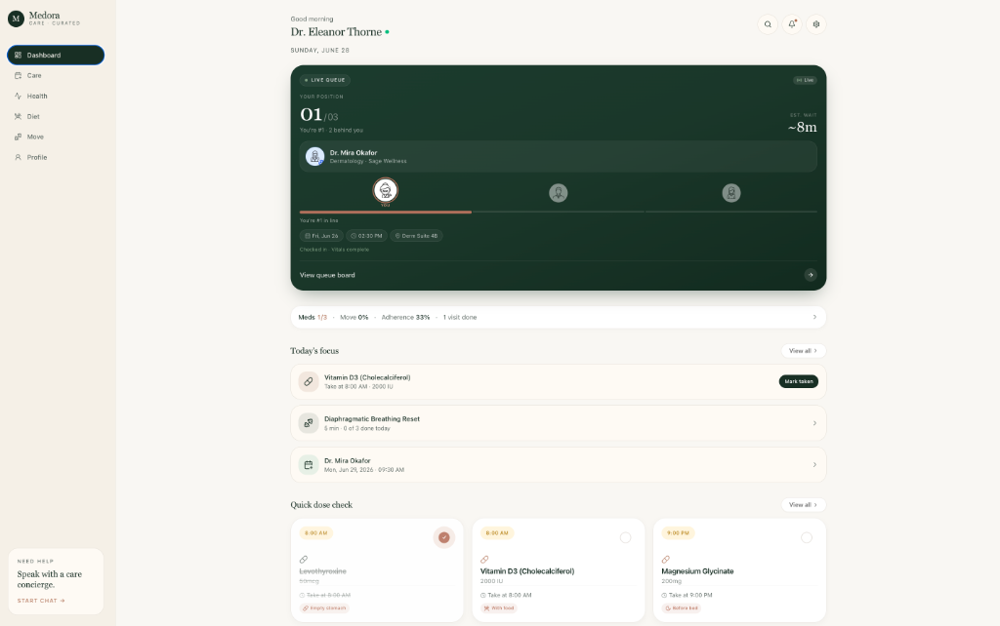
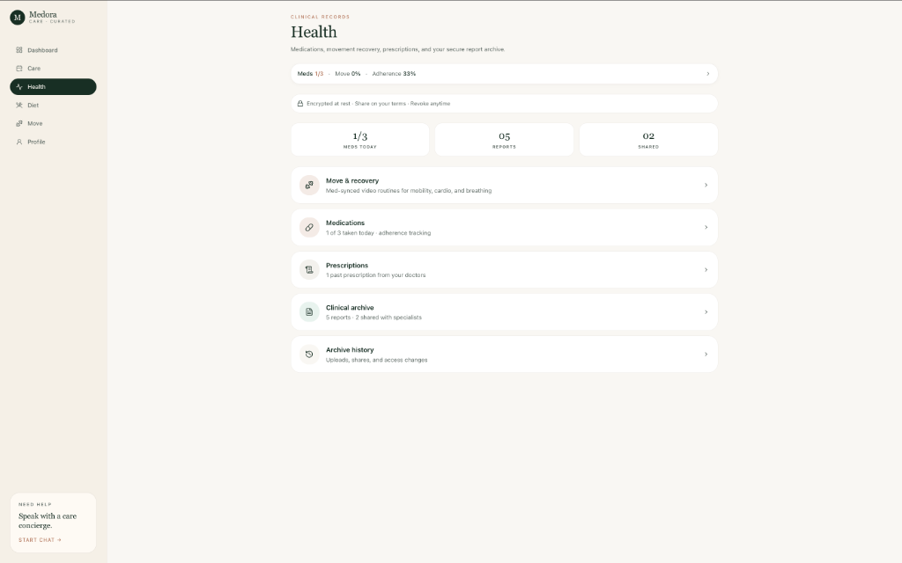
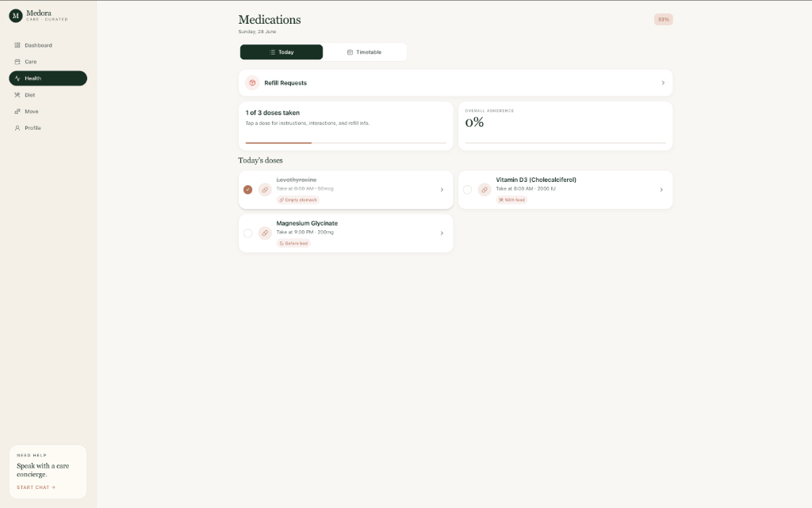
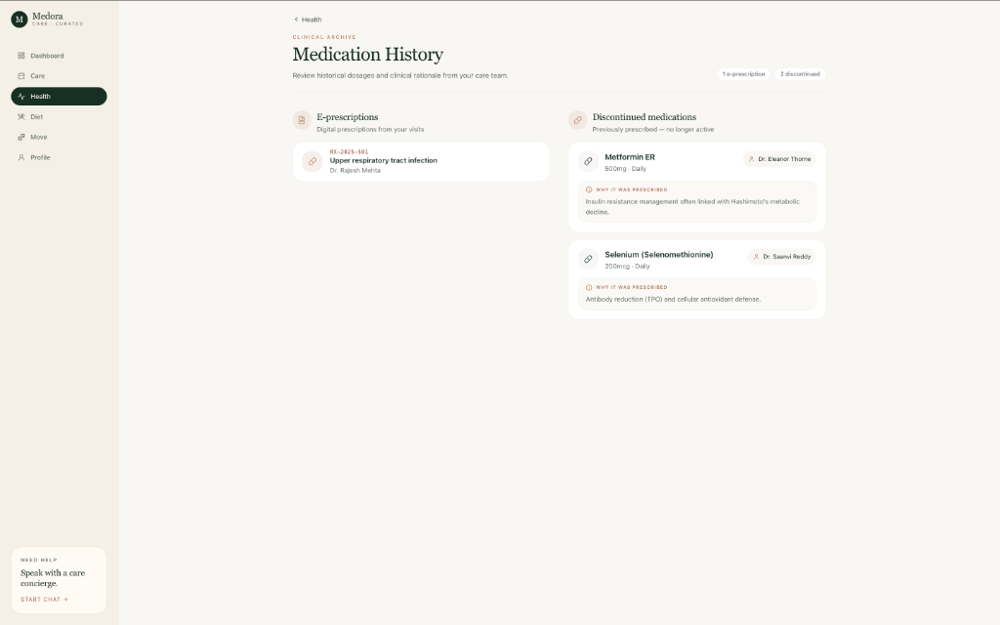

# Medora — Enterprise Hospital ERP & Clinical Workspace

Medora is a modern, premium Electronic Health Record (EMR) and Electronic Resource Planning (ERP) platform designed to digitize healthcare workflows from clinical doctor workspaces to patient engagement portals.

---

## 📸 Dashboard Screenshots

*Note: All dashboards and portal screenshots were captured at 50% browser zoom to display the full, responsive layout.*

### 🩺 Doctor Workspace

#### 1. Home Dashboard
*Clinician overview featuring consult queues, active patients, critical alerts panel, next-actions, and daily stats.*


#### 2. Patient Chart / EMR
*Comprehensive patient file displaying clinical timelines, lab values, prescriptions, and an interactive 3D anatomy body map.*


#### 3. Patients Panel
*Hospital directory displaying all active clinic patients sorted by clinical priority, status, and alerts.*


#### 4. Live Queue Board
*Interactive consultation desk tracker showing queue positions, wait durations, and check-in updates.*


#### 5. Inbox (Results to Review)
*Unified review page to inspect laboratory results, imaging files, and patient-shared diaries.*


#### 6. Prescribe Tool
*Build electronic prescriptions, perform medication reconciliation, and select from template protocols.*


#### 7. Schedule Grid
*View monthly, weekly, or daily visit appointments checklist.*


#### 8. Referrals Log
*Send, receive, and accept care transition handoffs across specialists.*


#### 9. Booking Slot Configurator
*Adjust consultation price fees, spacing times, and weekday active shifts.*


#### 10. Doctor Profile
*Manage clinical availability, review active ratings, and access technical support.*


---

### 👤 Patient Portal (Medora Care)

#### 1. Home Dashboard
*Patient landing page showcasing live consultation queue positions, daily medication schedules, and clinical actions.*


#### 2. Care Booking
*Allows patients to search specialists, book slots instantly, and track live queue wait times.*


#### 3. Health Hub & Clinical Records
*Aggregates prescriptions, daily medication tracking logs, and historical lab reports.*


#### 4. Active Medications Tracker
*Today's dose checkoff board displaying adherence ratios and medication administration instructions.*


#### 5. Medication History
*Directory detailing e-prescriptions, discontinued drugs, and historical clinical rationale.*


#### 6. Clinical Nutrition (Diet Planner)
*Provides thyroid-safe, medication-synced recipes categorized by budget tiers.*


#### 7. Recovery Movement (Move Planner)
*Guides patient recovery with thyroid-safe physical mobility video routines.*


#### 8. User Profile & Dependents
*Manages patient personal records, family dependents, and authorization consents.*


---

## 🚀 Key Modules & Functions (One-Line Summary)

### 🩺 Doctor Workspace (`/doctor`)
- **Home Dashboard**: Central hub displaying active consultations, wait times, approvals, next actions, and clinical stats.
- **Patient Chart / EMR**: Detailed medical history view containing vital logs, diagnosis history, and a 3D body map.
- **Patients Panel**: Filterable patient directory sorting active hospital patients by clinical status.
- **Live Queue**: Real-time consultation monitor to call, pause, or check out waiting clinic queue tokens.
- **Inbox Review**: Centralized mailbox to inspect and sign off on laboratory results and patient food diary photos.
- **E-Prescriptions**: Virtual prescriber to build medication instructions and send them to the pharmacy.
- **Schedule Calendar**: Integrated scheduler for managing daily in-person and video consultations.
- **Referrals Handoff**: Dedicated coordinator to exchange inbound and outbound patient referrals.
- **Slot Manager**: Availability scheduler to adjust slot timings, consultation pricing, and clinic room.
- **Doctor Profile**: Clinician profile management screen displaying feedback metrics and support lines.

### 👤 Patient Portal (`/patient`)
- **Patient Dashboard**: Live tracking dashboard displaying queue wait times, medication adherence, and daily clinical focus.
- **Care Scheduler**: Online appointment booking tool for choosing slots and managing visit schedules.
- **Health Hub**: Centralized records vault listing prescriptions, medication records, and clinical files.
- **Dose Checkoff**: Daily checklist allowing patients to track medication consumption compliance.
- **Med History**: Chronological archive listing current and discontinued prescriptions along with clinical rationale.
- **Diet Planner**: Clinical nutrition meal planner showing budget-tiered recipes synced with medication schedules.
- **Move Planner**: Physical rehabilitation guide offering guided movement tutorials tailored to the patient's condition.
- **Profile & Family**: Personal identity management screen allowing users to link child and parent dependents.

---

## 🛠 Tech Stack

- **Framework**: [React](https://react.dev/) + [TypeScript](https://www.typescriptlang.org/)
- **Routing**: [@tanstack/react-router](https://tanstack.com/router/latest)
- **Styling**: Vanilla TailwindCSS + Custom styling variables
- **Icons**: Lucide React
- **Notifications**: Sonner toasts

---

## ⚙️ Installation & Setup

1. **Clone the Repository**:
   ```bash
   git clone https://github.com/JyothirmayuduS/health-ally-pro.git
   cd health-ally-pro
   ```

2. **Install Dependencies**:
   ```bash
   npm install
   ```

3. **Configure Environment Variables**:
   *Copy the sample file and add your Supabase credentials (ignored by Git).*
   ```bash
   cp .env.example .env.local
   ```
   Add your keys in `.env.local`:
   ```env
   VITE_SUPABASE_URL=your_supabase_url
   VITE_SUPABASE_ANON_KEY=your_supabase_anon_key
   ```

4. **Run Development Server**:
   ```bash
   npm run dev
   ```

5. **Build for Production**:
   ```bash
   npm run build
   ```

---

## 🔒 Security & Git Policies

All `.env`, `.env.local`, and custom `.env.*` configuration files are explicitly ignored in `.gitignore` to prevent api key leaks.
